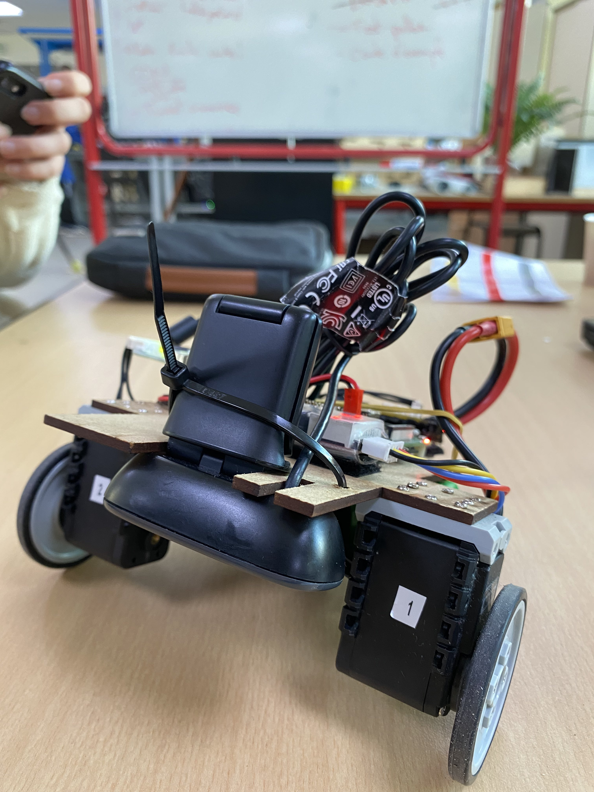

# FirstBot
> line follower robot

## Project Goals

The goal of the FirstBot project is to build your own first robot, which implies:

- Drawing our own frame using CAD software and tools from FabLab.
- Discovering how on-shelf actuators works.
- Working on an embedded system that is computationally and energitically autonomous.
- Processing images to extract visual features.
- Handling some basic kinematics to control the trajectory of the robot.
